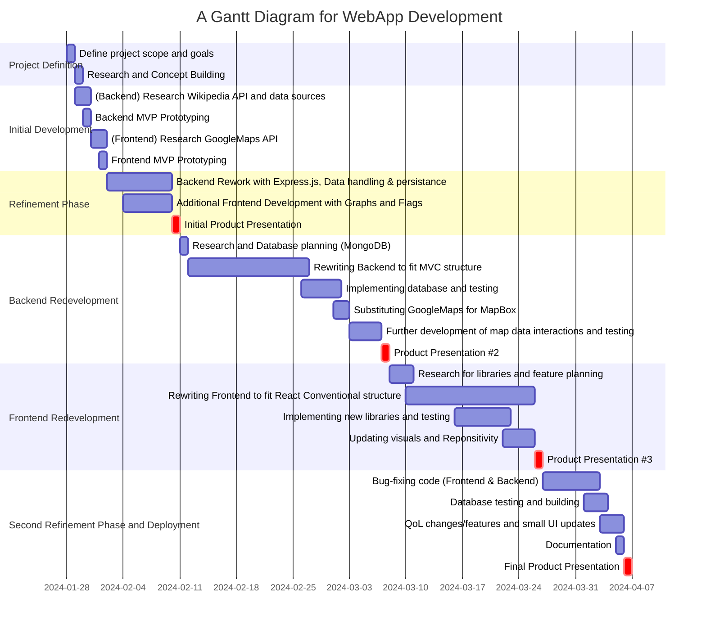
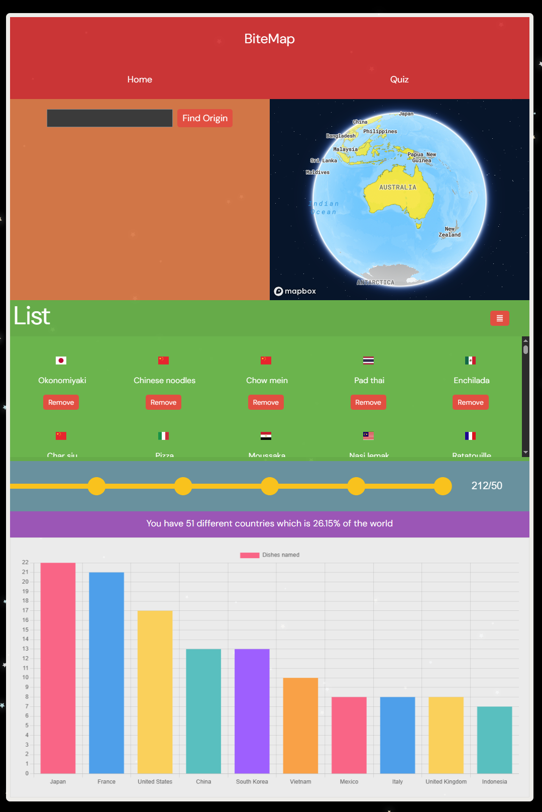
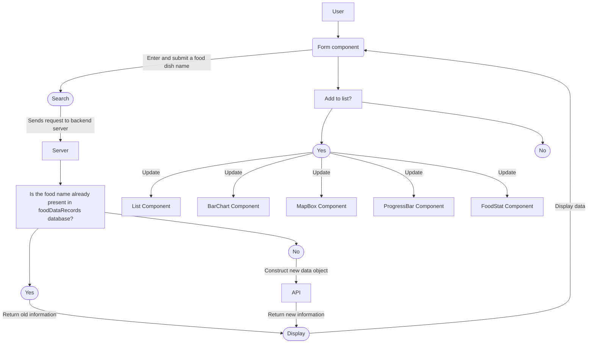
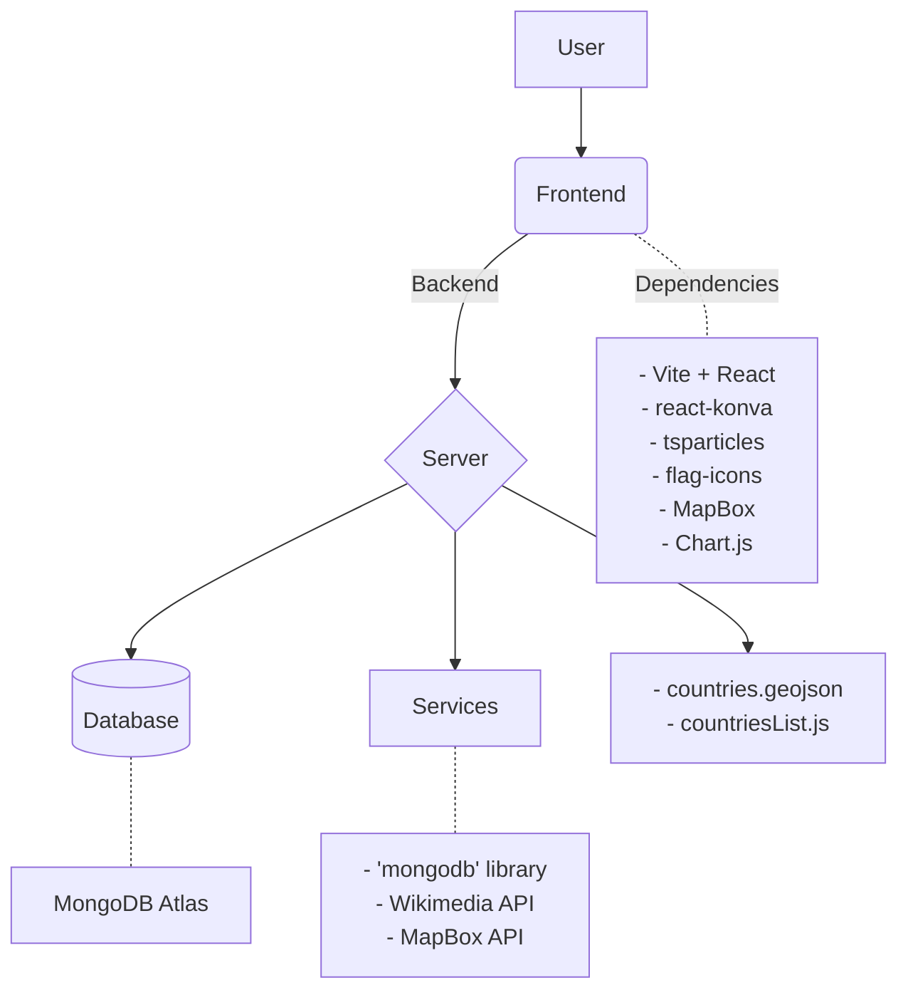
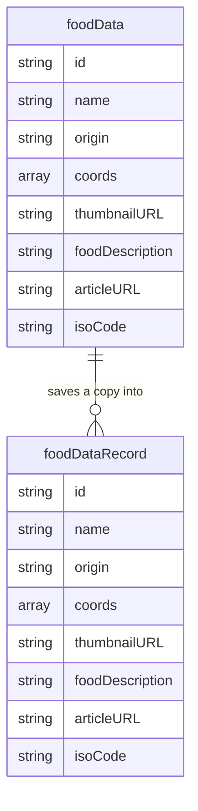

# BiteMap 

## Table of Contents
- [BiteMap](#bitemap)
- [Background](#background)
- [Timeframe](#timeframe)
- [Site](#site)
  - [Landing Page](#landing-page)
- [Usage](#usage)
  - [User Flow](#user-flow)
  - [Forking Repository](#forking-repository)
- [Known Issues](#known-issues)
- [Technology & Structure](#technology--structure)
  - [Frontend](#frontend)
  - [Backend](#backend)
  - [Database Structure](#database-structure)
- [Future Work](#future-work)

## Background

Sparked from a small curiosity and a simple idea, this mini-project, "BiteMap," is a interactive platform that allows food enthusiasts and cultural explorers to dive into the rich diversity of global cuisines. With BiteMap, you can track and discover dishes from all over the world.

### Overview and Goals
The goal behind the project is to essentially allow users to test their food knowledge by naming as many different foods as they can. The webapp can then provide the location of origin for every food name as well as track them and display various visuals that represent the users data. The intended incentive is to allow users to understand the extent of their culinary, geographic and cultural knowledge as well as promoting self-awareness and providing motivation to explore and learn about new uncharted knowledge.

## Timeframe

## Site

### Landing Page

The top red component contains the title and the links to two pages. Currently, the "Quiz" page is incomplete.

The orange form is the main component that the user will interact with in terms of input. A food name can be inputted into the form and when submitted the relevant will be displayed under the form and the map component to the right of it will update and display its location.

An "Add to list" button will then display, providing users the option to add food names to the green list component and this acts as storage for the users data. The yellow progress bar component, purple stat component, bar-chart component and map component will all update and change to reflect the current state of the data that is stored inside the list component.

## Usage
As briefly mentioned previously, users submit a food name and is met with returned information. The form component on submission sends the input to the backend which will perform a check on the project's secondary database. If that database has the information it will send it back to the frontend and if not it will call on external APIs for information and construct a new data object which is sent back to the frontend and a copy is stored in the secondary database for future reference.

After receiving information from the backend, the frontend will display the information. This includes the location of origin of the food, the flag of said location, a small description, a link to its wikipedia article and its location on the map component adjacent to the form component. The user now has the option to add the food name to the list component. If the list component is updated with the addition or removal of a food name, five other components that rely on this food list data will also update accordingly.

### User flow

### Forking Repository
1. Clone repository
2. Run 'npm install' in root directory. This should install 'npm concurrently' in order to run the backend and frontend at the same time
3. Run 'npm install' in the backend and frontend directories. This should install relevant libraries as listed below in the [Technology & Structure](#technology--structure) section
4. Run 'npm start' from root directory

### Known issues

Over 200 test cases have been run with the search algorithm and certain scenarios have been recorded for due updates.
| UNFIXED |
|--------------|
| Multiple countries may be found after 'phrase' is identified: https://en.wikipedia.org/wiki/Fairy_bread , https://en.wikipedia.org/wiki/Hamburger , https://en.wikipedia.org/wiki/Chili_con_carne , https://en.wikipedia.org/wiki/Hamburger , https://en.wikipedia.org/wiki/Fajita |
| Origins may not be country specific and be a larger inclusive region: https://en.wikipedia.org/wiki/Biryani , https://en.wikipedia.org/wiki/Shawarma |
| Origins may reference continents instead of countries: https://en.wikipedia.org/wiki/Jollof_rice , https://en.wikipedia.org/wiki/Flan_(pie) |
| Origins may be a short description instead of country names: https://en.wikipedia.org/wiki/Ceviche |
| Origins may not be country specific and be oddly named instead i.e. an old country that doesn't exist: https://en.wikipedia.org/wiki/Couscous | 
| 'Associated Cuisine' as an included phrase has not been implemented yet: https://en.wikipedia.org/wiki/Pavlova_(dessert) , https://en.wikipedia.org/wiki/Ikan_bakar |
| The algorithm returns the first matched country and is susceptible to alphabetical bias: https://en.wikipedia.org/wiki/Cannoli , https://en.wikipedia.org/wiki/Green_papaya_salad , https://en.wikipedia.org/wiki/Cr%C3%A8me_br%C3%BBl%C3%A9e , https://en.wikipedia.org/wiki/Mango_pudding , https://en.wikipedia.org/wiki/Clambake , https://en.wikipedia.org/wiki/Char_kway_teow , https://en.wikipedia.org/wiki/Bulgogi |
| United States may be referred to as 'US' instead: https://en.wikipedia.org/wiki/Vichyssoise |
| A list of 'regional variants' may be included and list a large amount of countries: https://en.wikipedia.org/wiki/Jalebi |
| Redirecting may not be enough for certain food items as they might have a page with a large amount of possible links |

## Technology & Structure 

### Frontend

- [React](https://react.dev/) - React serves as the core library in building user interface 
- [react-konva](https://konvajs.org/docs/react/Intro.html) - Used to build the progress bar component
- [tsParticles](https://particles.js.org/) - Used to create the animated background
- [flag-icons](https://www.npmjs.com/package/flag-icons) - CSS library used to render flags using ISO 3166-1-alpha-2 codes
- [MapBox](https://www.mapbox.com/) - Used to create MapBox component as well as retrieve geolocation data
- [Chart.js](https://www.chartjs.org/) - Used to visualize data

### Backend

- [countries.geojson](https://github.com/datasets/geo-countries) - Pulled from public github repo and rendered with MapBox
- [mongodb](https://gist.github.com/kalinchernev/486393efcca01623b18d) - Pulled from github and used as reference point for country matching in algorithm
- [Wikimedia API](https://api.wikimedia.org/wiki/Main_Page) - Main body of algorithm used to create food data objects
- [MapBox Api](https://docs.mapbox.com/api/overview/) - Usage in backend involves obtaining coordinate data from country names

#### Database Structure

## Future Work
As BiteMap continues to evolve, we have several enhancements and new features planned to enrich the platform and provide a more comprehensive experience. These include:

 - Implementing a taste profile in the form of a radar chart (sweet, sour, salty, bitter, umami)
 - Incorporating multi-region data
 - A new quiz mode
 - Implementing user profiles so people can save their data